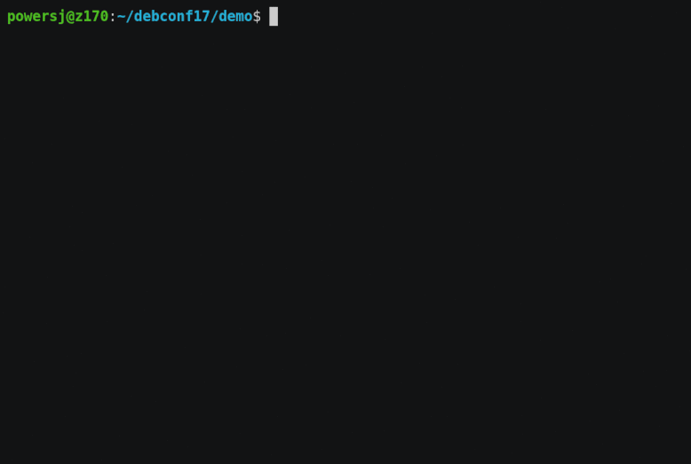

<!-- _backgroundColor: aquq -->

<!-- _color: orange -->

<!-- paginate: false -->

# What is asciinema? And how to install & use it
Asciinema is a tool for recording terminal sessions. Normal screen recording tools are recording the GUI, but for console, we don't need to use recorders like OBS. We can use a tool that is only recording the terminal session, and the tool for it is asciinema. You can follow this superfast guide for installing asciinema and using it. It is very simple and easy to use tool.

## Install asciinema

If you're a Windows user, you can try to run asciinema in WSL.

##### Installing via pip

```
sudo pip3 install asciinema
```

##### Arch Linux
```
pacman -S asciinema
```
##### Debian
```
sudo apt-get install asciinema
```

##### Ubuntu
```
sudo apt-add-repository ppa:zanchey/asciinema
sudo apt-get update
sudo apt-get install asciinema
```

##### macOS
```
brew install asciinema
```

# How to record terminal sessions with asciinema

we're now in the main part which is using it. asciinema is so easy to use. all we have to do to record terminal session is to run command below

```
asciinema rec filename
```
after this command, terminal session will be recorded. to exit terminal session, we can use following command
```
exit
```
to play the record, we can simply type
```
asciinema play filename
```
if we don't want any record created on system, we can type
```
asciinema rec
```
since we did not specify the name of the file, it will ask us for uploading it or saving it locally.
```
asciinema: recording finished
asciinema: press <enter> to upload to asciinema.org, <ctrl-c> to save locally
```
then we can select uploading and after selection, it will give us an URL to our record\
we can play records from internet, all we have to do is type
```
asciinema play url
```
replace url in above code with the actual url of the record\
we can view our record in a browser, we need the link for viewing it.\
after viewing, we can select what will happen to uploaded record. if we want to link the record with our asciinema account, we can do that. if we want to make it private, we can also do that. it's up to us.

# 🍉
