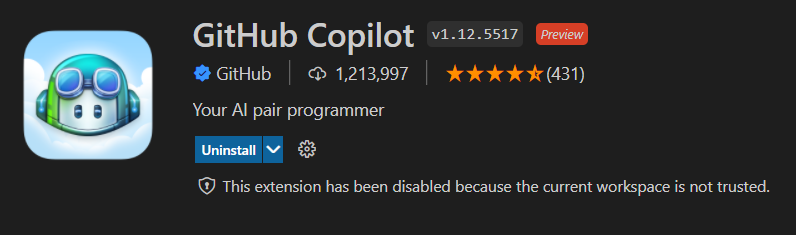
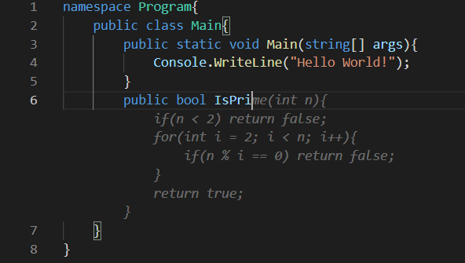

<!-- _backgroundColor: aquq -->

<!-- _color: orange -->

<!-- paginate: false -->

# How to install and use Github Copilot (Superfast Guide)
This guide is going to cover the installation of Github Copilot with Vscode. Github Copilot can be used with another IDEs via Github Copilot extension.

## First Step

[Go to this page](https://github.com/features/copilot/signup) and join the waitlist of Github Copilot. After review of your account, they will allow you to use Github Copilot after an amount of time.

## Second Step

install the Github Copilot extension for vscode

 After installation, extension will ask you to sign in using Github. After authorizing your account with this extension, you are free to use Github Copilot with vscode.

 ## See Your First Suggestion
 To see suggestions, let's say we want to have a function that checks if the number is prime or not, we can either write a comment line explains what required function will do, or we can simply type the function's name.
 
 - Above is an example with typing the function name