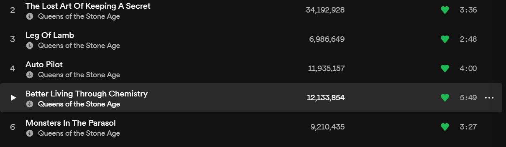
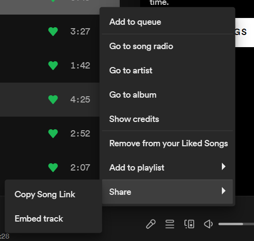
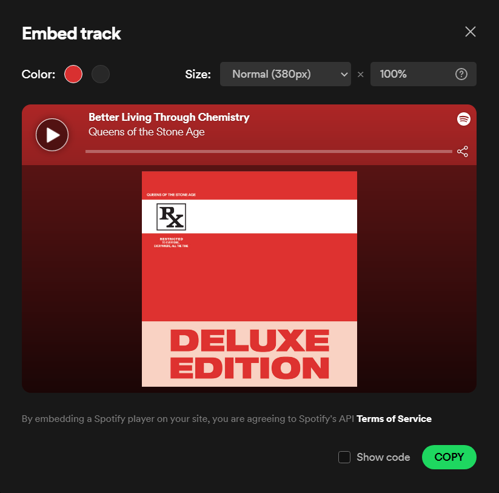

<!-- _backgroundColor: aquq -->

<!-- _color: orange -->

<!-- paginate: false -->

# How to embed Spotify playlists, albums or tracks

Have you ever wanted to put a playlist you like in your website? You can do it with the embed code Spotify is automaticaly creating for you, all you have to is following the steps.

### Open the playlist, track or album you want to share

### Click 3 dots sign and select share > copy embed track

### Customize your embed code

If you want to see the code, you can check 'Show code' box.
### Click copy
Copy the embed code. In this case I use given code

```html
<iframe style="border-radius:12px" src="https://open.spotify.com/embed/track/3wOKvS2aaiIj86KnAzMbV0?utm_source=generator" width="100%" height="380" frameBorder="0" allowfullscreen="" allow="autoplay; clipboard-write; encrypted-media; fullscreen; picture-in-picture"></iframe>
```

### Enjoy
That's it! Now you have your pretty playlist on your website 🍉  
Careful before you press the play button. Check your volume level, it can be too loud 🤫

<iframe style="border-radius:12px" src="https://open.spotify.com/embed/track/3wOKvS2aaiIj86KnAzMbV0?utm_source=generator" width="100%" height="380" frameBorder="0" allowfullscreen="" allow="autoplay; clipboard-write; encrypted-media; fullscreen; picture-in-picture"></iframe>

